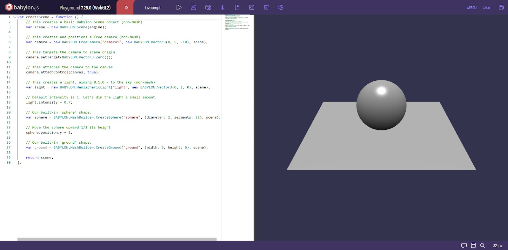
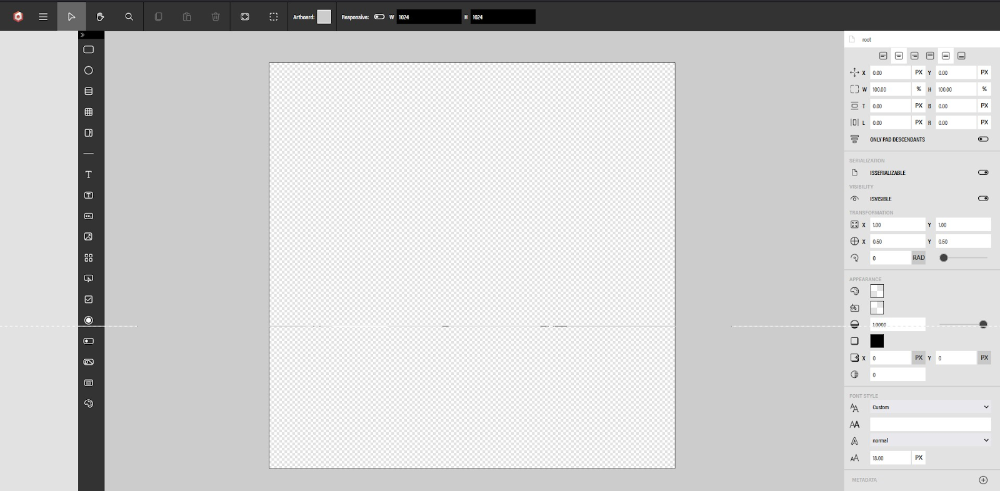
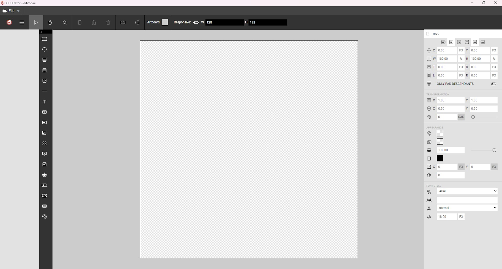
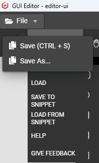
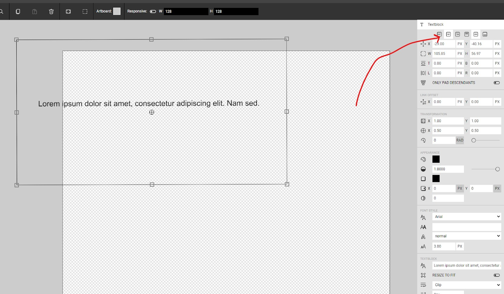
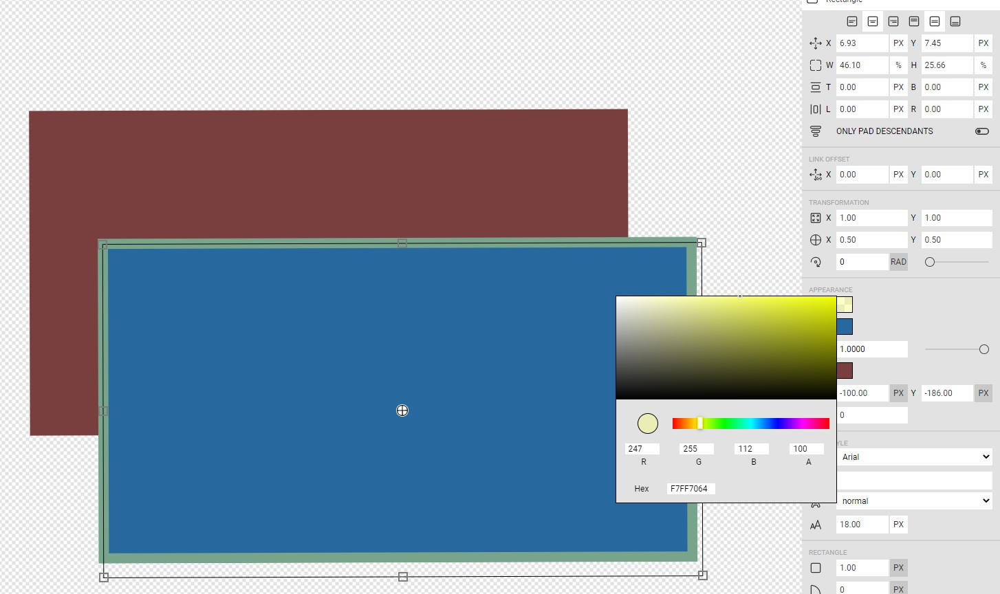
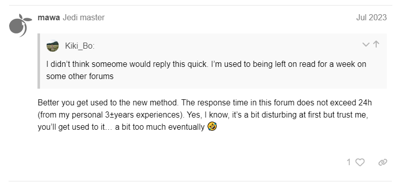

# Lessons Learned While Making a Responsive UI in BabylonJS for a web game

Whether you're here to learn about BabylonJS or stumbled upon this article during an internet dive—welcome! 

To be clear, I’m no expert in UI design, BabylonJS, JavaScript, or TypeScript. This is more of a diary entry about my first experience with BabylonJS. I'll share the good, the bad, and the ugly, along with a few quirky bugs I encountered. Some of the things I did were reworked later, but I hope my insights can still be helpful. 

With all the knowledge I have now, there are definitely things I would do differently. So, take what you can from this, but don’t feel bound to follow my path!  

## BabylonJS Editor v4.7.0 

 

I started my journey with the BabylonJS Editor (a community-managed visual editor for Babylon.js), specifically version 4.7.0. Currently, version 5.0.0-alpha.5 is available for download, so some things may have changed. 

One thing I must commend BabylonJS for is the wide range of tools available on their website. You can easily open a new tab and start creating right away! 

## [Playground:](https://playground.babylonjs.com)
 

Playground is a how the name suggests a space where you can quickly try fun ideas in video game engine without a need to install anything on your computer. On the left you have a code window “IDE” where an example of code is you can run and, on the right, you have your render scene. Code can be either TypeScript or JavaScript. I had a little to none experience with this language beforehand starting learning Babylon. But TypeScript is very similar to C# so I could read it right away and write some basics soon too. I think this is a really good option if somebody is doing websites right now and want to try learning how to make games or do a little project in their free time. 

 

Also, when you have problem in your project you can easily copy the code, where the problem is and past it here. Save it and generate a URL for this specific code snippet and post it on the forum or share it with anybody. Thanks to this I got helped from the forum on a few of my problems.  

 
 
## Choosing the Right UI Approach 

Before starting my first project, the first challenge I faced was choosing which UI system to use. 

Choosing the right approach for responsive UIs in web games makes a big difference in development efficiency and user experience. I experimented with both BabylonJS built-in GUI system and traditional HTML/CSS-based GUIs, and the contrast between the two approaches became evident quickly. 

Here are a few GUI options to choose from: 
   - HTML-based GUI 
   - UI with HtmlMesh (was added recently in the documentation I will not talk about it here) 
   -  Babylon 2D GUI 
   -  Babylon 3D GUI. 

The 2D GUI is tightly integrated with the 3D scene, allowing for post-processing effects and interaction with meshes, but it’s less flexible than HTML and can appear blurry at times. The HTML-based GUI, on the other hand, offers near-unlimited flexibility, responsiveness, and performance, but lacks direct integration with 3D elements and cannot be used in VR. Both can be used together depending on project needs. 

I chose Babylon 2D GUI to see possibilities Babylon has so I will talk about them in this article. 
 

## [GUI EDITOR:](https://gui.babylonjs.com) 

Now we have these two: 

 

 

 

You might think, 'Hmm, Kiki, these look exactly the same—what’s up with that?' And you'd be almost right. BUT don’t be fooled. They’re not the same picture.  

One is the web version (the upper one), and the other is from the downloaded Babylon.JS Editor. You need to be careful how you use them. 

 

Also, side note when I wanted to edit something in JSON File. I had to export this file from the editor as JSON. Edit it. And then upload it back. Change canvas size, because the editor will not read this information and do it for you. 

 

And, there is a difference between these two saving options (in the hamburger menu and in the File menu): 

 

Oh, and save to snippet is another third different saving method. Be careful out there. 
 

## Bugs Galore 

 

  -  One of those two editors won’t save your chosen font, so you’ll have to manually edit the JSON file (yes, all UI is stored in JSON and GUI files). It will then stay there but if you ever touch the font settings again, you will have to edit it again. 

 

  -   One will crash if you accidentally input something other than a number (which, I guess, is a bug). So remember your ABS. Always Be Saving. (PS: For an example never put “+” into custom font name, or click on Grid for your layout)  
 

   -  It doesn’t do good also with rounding numbers, I had to go back into JSON a lot to clean numbers to 3 decimal places. When you try to position something in the editor it will create 8 decimal monstrosities. You are better of writing those sizes of canvas, windows or pictures yourself. 

 

   -  Rotating elements in UI is done with Radians and only in One Direction. You must choose from 0 to 6.28 and you can’t go over that or under that. Which might not seem like a big problem. Oh boy, I definitely shed some tears over this one. 

 

   -  Oh, you want to center your UI elements. Yeah, we have button for that. You want to center text inside the UI element? Use the same button. Yeah, we want to make it easier so we will give you the same button for both. Oh, but if want to center your UI Text element and not the text. You will have to pray to your god and click some special combination which we will not tell you beforehand. And after? Good luck centering your text element in the middle of your element. Now forever you will be able to only center your UI element in Canvas. (I had manually edit this in JSON Files “by hand” for final positioning). 

 

   -  Also good to know. First the position is done and then the transforming is done. When you in JSON text “resize” something “by hand”. Oh boy good luck with your UI positions. There will be a lot of recalculating done. 

 

   -  Borders are inner which is not a big problem, I think. I just wanted outline of things. And I expected it to be around the object? But it is inside the element and over it. It will block your element and has alpha? Not a thing here you can use. For an example, me trying to add “light-yellow see-through outline”: 

 

 

 

   -  You cannot have custom slider image in your scroll viewers. There is not a lot of edit possibilities for a lot of UI elements here. 

 

Well as you can see some of these are bugs and some of these are just simplicity problem of this Editor. I would recommend it for people new to game development or that want to quickly sketch UI. But for a custom UI design you prepared in Figma you should go with something else. I think it is quite limited for people who made website before. You cannot use your bootstrap premade elements here. 

 

## Figma and BabylonJS Editor Integration 

 

Talking about Figma. One thing that should have been good for us was Exporting from Figma into Babylon. I was looking forward having to be able to use this feature. This plugin is custom user made from somebody else, I don’t blame Babylon for this. But it is quite unusable and so I had to save the UI screen in Figma as a JPG, import it as an image into the editor, and then set up the correct canvas sizes to match the UI dimensions. And then went element by element in the Figma, CTRL+C and CTRL+V every single little thing like position X, position Y, sizing, rotation, fonts and everything by hand. And in Babylon it didn’t match the JPG template I made. I had to just guess the position by making the element see through with alpha and seeing if that is the right position. This also meant I had to go through the JSON file again to edit all image sources, as they differed between the editor and the game. One of problems with the exporting is the lack of support for polygons; the plugin simply skipped them during the transfer. My workaround involved exporting these elements as PNGs and then importing them as images into the game—an extra step that was both time-consuming and annoying. But I found out later that the owner of the plugin stated these limits, but I didn't know about it because it was on another website. 

Another issue arose with color consistency. The color space conversion between Figma and BabylonJS wasn’t 1:1, specifically with sRGB colors. This led to subtle, yet noticeable, differences in how colors appeared in the game versus the design, complicating the UI implementation. 

And sizing was a pain in the end a lot. Because it was not made for iPhone. The good thing: it will run on any devices thanks to it being in the web browser, was also my doom. I had to fix a lot of issues thanks to it being in Firefox or it being in safari on iPhone etc. You can’t hide the browser elements. You must make your game based with that and YOU CANNOT Fullscreen on iPhone. NEVER. Sooo it will never look that good and it will be wrongly sized if run in the browser. 

And if it was not everything on mobile Babylon GUI was pixelated. I don’t want to go into that, but HTML/CSS would probably work better here. 

One I guess bug is: After loading into the game from anywhere I had to put in code “wait” for one frame, then reloading the UI by resizing it 1 pixel up then 1 down so the UI positions would fix. If I didn't do that, all text would not be centered, and I think I started balding before I found how to fix this. 

There are many more tools like Sandbox, Node Material Editor, different Exporters or newly added Spector.JS which are looks really cool, but I have not yet tested them, so I didn’t talk about them. But I really appreciate every one of them even if I sounded harsh here. I now know that I took granted a lot of things other more complex Engines have from a get go. 
 
## Lessons Learned 

  1.  Be Prepared for Workaround:   
 Working with BabylonJS requires a certain level of flexibility and a willingness to experiment with workarounds. Many of the framework's limitations forced me to get creative, whether it was manually editing JSON files or faking UI effects that weren’t natively supported. 

  2.  Flexibility in Approach:   
I learned the importance of being adaptable, especially when initial approaches didn’t work as expected. For instance, exporting polygons as PNGs or restructuring the UI to accommodate the limitations of the BabylonJS Editor became necessary strategies. 

  3.  Importance of Testing Across Devices:   
 Finally, thorough testing across multiple devices and browsers was crucial. The differences in how BabylonJS behaves on different platforms can’t be overstated, and catching these issues early saved me a lot of headaches down the line. 

## Conclusion 

I would recommend using another approach (HTML/CSS). I think BabylonJS GUI has potential, but right now it's lacking features, details, and has too many bugs. But for newcomers to Game Development and Web Development it is very cool. I think this is perfect for schools or some courses for beginners in Gamedev. Everybody can open it on their laptops right away without installing anything. They can share stuff easily and work together easily. The community of developers of Babylon or games in it, Forums is one of the best and the nicest I ever come across. It just needs a little bit more love. 

And a bonus bug for those that got here. Maybe the worse of them all. There is no undo button or undo option. If you accidently delete something you have to load the file agian. So after every single change you want to keep you should save. And also keep multiple backups. Just in case... :wink: