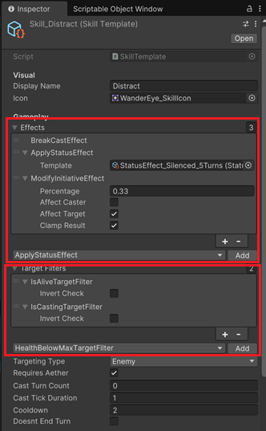
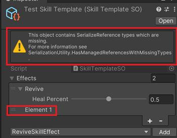

## Introduction

What is a serialized pipeline?
    
We're using pipeline in a reductive sense, as in general pipelines can get very complicated (rendering pipeline). Our definition of a pipeline is an array of pipes that get executed in order and which may contain some additional data. The second clarifier is in the serialization so our specific pipeline lives as an asset rather then fully in code, which has it's own benefits. Lastly the pipeline decides which pipes to include and how to order them, making the system modular.

Why use a pipeline?

Many real-world processes can be defined using this pattern. For instance, a manufacturer's assembly line is a perfect example of a pipeline. Or a game strategy can be defined in a pipeline, there are factors that we evaluate first, before deciding to use more niche approaches. What can be defined in the real world often translates well into the structure of a video game and so here we are, making a pipeline.

Key parameters to our pipeline

1. One asset per pipeline definition.

    - This helps prevent reference conflicts with other assets, though it allows for references if necessary. A significant advantage is the simplicity of seeing everything upfront. On the other hand, asset nesting can complicate the authoring process, especially when trying to keep the entire pipeline context in mind.

2. Data and execution independence.

    - We define only an interface, with the implementing struct or class handling both execution and serialized data.

`SerializeReference` attribute is key to this process, as it enables the serialization of interfaces (or abstract classes), making our pipeline both data- and implementation-agnostic. However, while `SerializeReference` plays an important part, most of the setup lies in creating custom inspectors and the use of reflection.

## Quick bullet-points

Benefits:
- Designer-friendly: Designers can tweak the pipeline without coding.
- Doesn’t require recompile after modifying data or order (avoid making unity into a loading screen). 
- Modular

Drawbacks:
- Renaming pipeline element class will break data bindings (see in Tips how to resolve it). 
    
Requirements:
- SerializeReference
- Reflection
- CustomEditor
- (Optional) Custom attribute

## Example

Here's an example on how I used serialized pipeline in my game for defining skill effects and targeting. 


## Steps

### Setup

Let's start by creating a `SkillTemplateSO` ScriptableObject that will hold an array of effects to be applied to the target unit when a skill is cast.

```csharp
[CreateAssetMenu]
class SkillTemplateSO : ScriptableObject 
{
	[SerializeReference] private ISkillEffect[] _effects;
}

interface ISkillEffect 
{
	public bool CanBeApplied(Unit target);
	public void Apply(Unit target);
}
```
  
Now we have the `SerializeReference` part done. Let’s add some concrete skill effects we could use in-game.


```csharp
struct DamageSkillEffect : ISkillEffect 
{
	[SerializeField] private int _amount;
	[SerializeField] private DamageElement _element;

	public bool CanBeApplied(Unit target) 
		=> !target.isInvulnerable && target.isAlive;

	public void Apply(Unit target)
		=> target.DealDamage(_amount, _element);
}

struct ReviveSkillEffect : ISkillEffect 
{
	[SerializeField] private float _healPercentage; 

	public bool CanBeApplied(Unit target) 
		=> !target.isAlive;

	public void Apply(Unit target)
		=> target.Heal(target.maxHealth * _healPercentage);
}
```

At this point, everything looks good. However, Unity’s default inspector won’t allow us to populate the SerializeReference array with our newly created effects.

There are two approaches to solve this, which I’ll outline below:
- [A] A simple and direct method.
- [B] A more advanced but reusable approach.

### [A] Direct method

We can dedicate a special custom editor for handling the enumeration and addition of new elements.

```csharp
[CustomEditor(typeof(SkillTemplateSO))]
public class SkillTemplateSOEditor : Editor
{
    private SkillTemplateSO _target;
    
    private Type[] _skillEffectTypes;
    private string[] _skillEffectTypesNames;
    private int _selectedSkillEffectIndex;
    
    public void OnEnable()
    {
        _target = (SkillTemplateSO) target;
        _skillEffectTypes = FetchSkillEffectTypes();
        _skillEffectTypesNames = _skillEffectTypes.Select(effectType => effectType.Name.Split('.')[^1]).ToArray();
    }

    public Type[] FetchSkillEffectTypes()
    {
        Type skillEffectType = typeof(ISkillEffect);
        return skillEffectType.Assembly
            .GetTypes()
            .Where(type =>
                skillEffectType.IsAssignableFrom(type) &&
                type != skillEffectType && !type.IsAbstract
            ).ToArray();
    }
        
    public override void OnInspectorGUI()
    {
        DrawDefaultInspector();
            
        GUILayout.BeginHorizontal();
        _selectedSkillEffectIndex = EditorGUILayout.Popup(_selectedSkillEffectIndex, _skillEffectTypesNames);
        if (GUILayout.Button("Add Effect"))
        {
            var newEffect = (ISkillEffect)Activator.CreateInstance(_skillEffectTypes[_selectedSkillEffectIndex]);
            Array.Resize(ref _target.effects, _target.effects.Length + 1);
						_target.effects[^1] = newEffect;
        }
        GUILayout.EndHorizontal();
    }
}
```

### [B] Contextual inspector attribute

The improved approach contains 2 parts. The first part involves creating a custom `AddToArray` attribute, which can draw the required inspector extensions once context is provided. The second part involves creating a base custom editor for SOs that supplies the context and overrides Unity's default inspector rendering.

```csharp
[AttributeUsage(AttributeTargets.Field)]
public partial class AddToArrayAttribute : Attribute
{
    public string buttonText;
    
    public AddToArrayAttribute(string buttonText)
    {
        this.buttonText = buttonText;
    }
}

#if UNITY_EDITOR
public interface ISerializedPropertyAttributeInspector 
{
    public void Init(UnityEngine.Object owner, SerializedProperty property, FieldInfo fieldInfo);
    
    public bool DrawProperty();
}


public partial class AddToArrayAttribute : ISerializedPropertyAttributeInspector
{
    private SerializedProperty _property;
    private int _selectedIndex;
    private string[] _dropdownOptions;
    private Type[] _types;
    private bool _isValid;

    public void Init(UnityEngine.Object owner, SerializedProperty property, FieldInfo fieldInfo)
    {
        if (!property.isArray)
        {
            _isValid = false;
            return;
        }

        _property = property;
        var fieldValue = fieldInfo.GetValue(owner);
        var fieldValueTypeName = fieldValue.GetType().ToString();
        var fieldNonArrayTypeName = fieldValueTypeName.Substring(0, fieldValueTypeName.Length - 2);
        var fieldNonArrayType = owner.GetType().Assembly.GetType(fieldNonArrayTypeName);

        _types = ReflectionHelpers.GetDerivedTypes(
            fieldNonArrayType, 
            includeAbstract: false, 
            includeBase: false, 
            fieldNonArrayType.Assembly).ToArray();
        _dropdownOptions = new string[_types.Length];
        for (int i = 0; i < _types.Length; i++)
        {
            _dropdownOptions[i] = _types[i].Name;
        }
        _isValid = true;
    }

    public bool DrawProperty()
    {
        if (!_isValid)
        {
            return false;
        }
        
        bool isDirty = false;
        GUILayout.BeginHorizontal();
        _selectedIndex = EditorGUILayout.Popup(_selectedIndex, _dropdownOptions);
        if (GUILayout.Button(buttonText, GUILayout.Width(80)))
        {
            var newInstance = Activator.CreateInstance(_types[_selectedIndex]);
            _property.InsertArrayElementAtIndex(_property.arraySize);
            _property.GetArrayElementAtIndex(_property.arraySize - 1).boxedValue = newInstance;
            isDirty = true;
        }
        GUILayout.EndHorizontal();
        return isDirty;
    }
}

[CustomEditor(typeof(ScriptableObject), true)]
public class BaseSOEditor : UnityEditor.Editor
{
    private List<ISerializedPropertyAttributeInspector> _serializedPropertyAttributeInspectors;

    protected virtual void OnEnable()
    {
        _serializedPropertyAttributeInspectors = new List<ISerializedPropertyAttributeInspector>();

        var type = serializedObject.targetObject.GetType();
        foreach (var fieldInfo in type.GetRuntimeFields())
        {
            var property = serializedObject.FindProperty(fieldInfo.Name);
            var addToArrayAttribute = fieldInfo.GetCustomAttribute<AddToArrayAttribute>();
            if (addToArrayAttribute != null)
            {
                addToArrayAttribute.Init(serializedObject.targetObject, property, fieldInfo);
                _serializedPropertyAttributeInspectors.Add(addToArrayAttribute);
            }
        }
    }

    public override void OnInspectorGUI()
    {
        bool isDirty = false;
        DrawDefaultInspector();
        foreach (var serializedPropertyAttributeInspector in _serializedPropertyAttributeInspectors)
        {
            isDirty |= serializedPropertyAttributeInspector.DrawProperty();
        }
        if (isDirty)
        {
            serializedObject.ApplyModifiedProperties();
        }
    }
}
#endif
```

The setup may be a bit cumbersome, but offers significant advantages by reducing repetitive patterns. Similarly, you can leverage additional custom attributes to enhance the editor's functionality even further.

# Tips

If you lose data bindings because of a rename, there are 2 ways to restore them.



1. Open the problematic .asset files and rename lines with `type: {class: OLD_CLASS_NAME, ns: , asm: ASSEMBLY}` with a new class name, it will rebind itself on refresh (use regex at your own risk)
2. Or you can revert the rename
        
    ```
    effects:
        - rid: 2764383452201484288
        - rid: 2764383452201484290
        references:
        version: 2
        RefIds:
        - rid: 2764383452201484288
            type: {class: ReviveSkillEffect, ns: , asm: Assembly-CSharp}
            data:
            healPercent: 0
        - rid: 2764383452201484290
            type: {class: DamageSkillEffect, ns: , asm: Assembly-CSharp}
            data:
            amount: 1
    ```